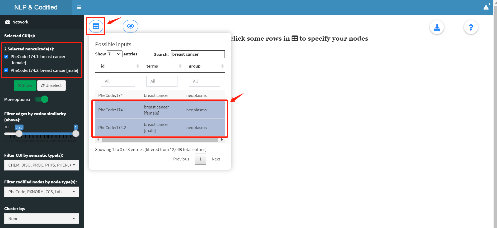
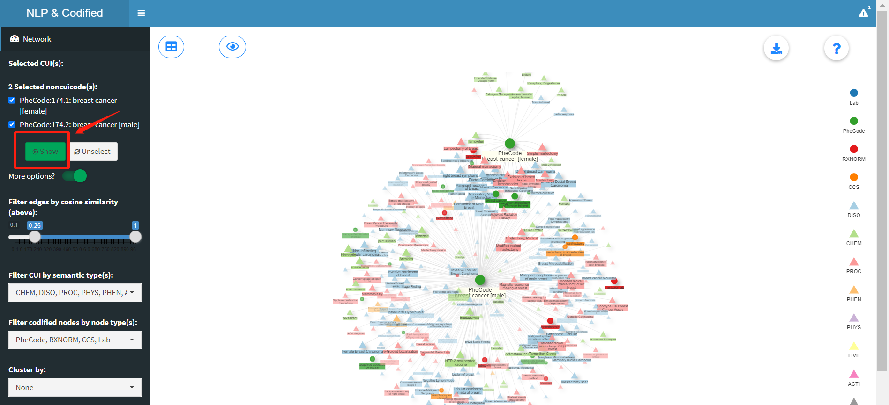
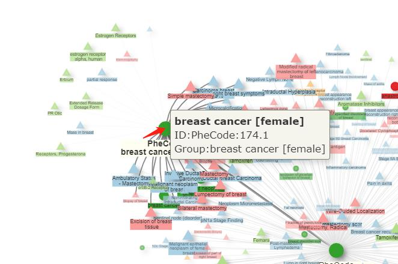
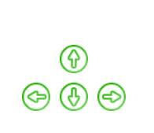
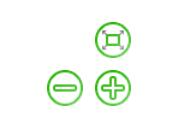
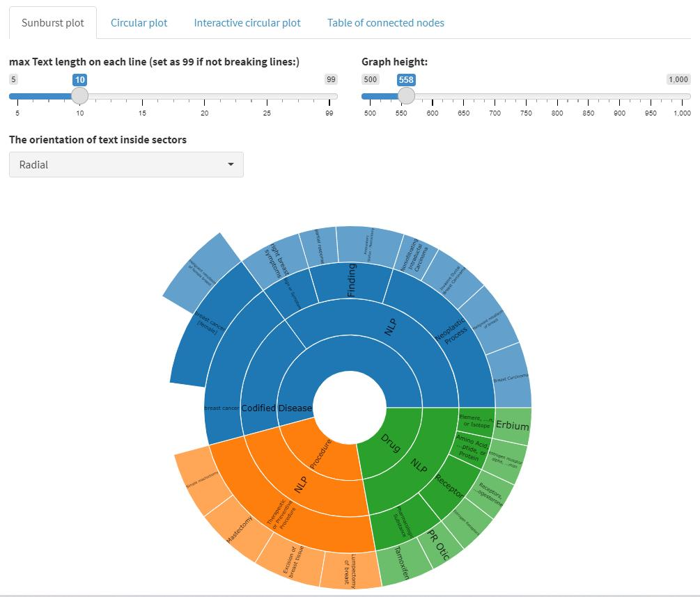
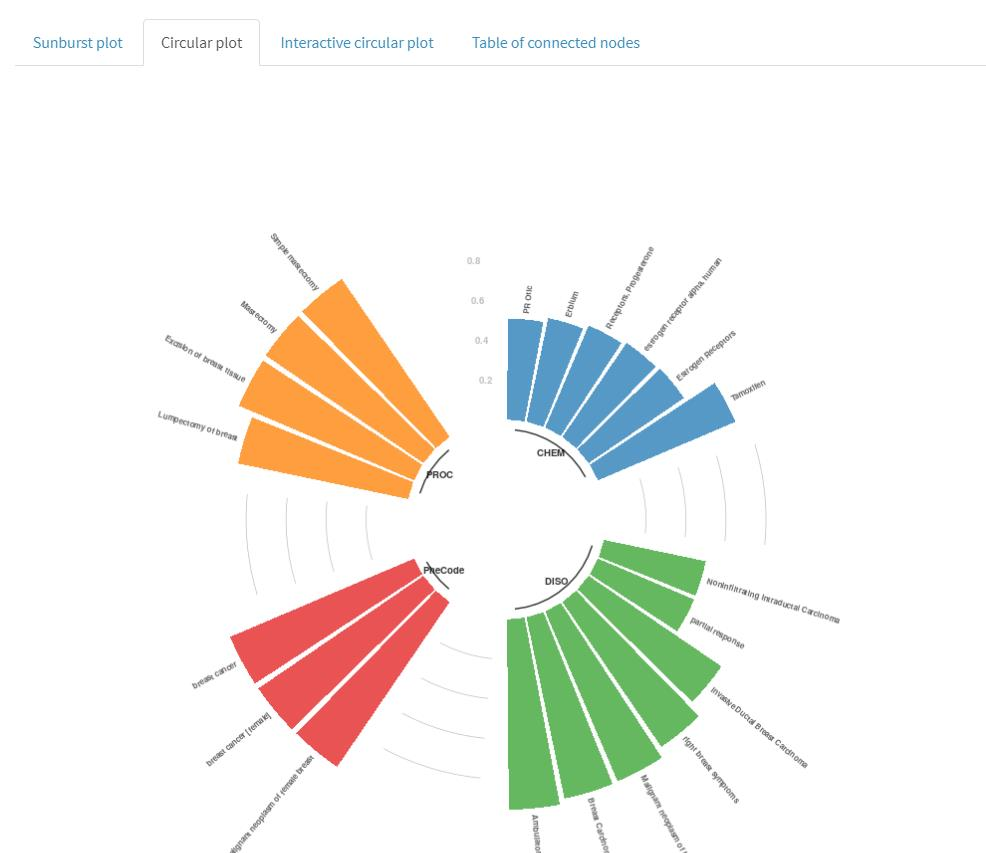
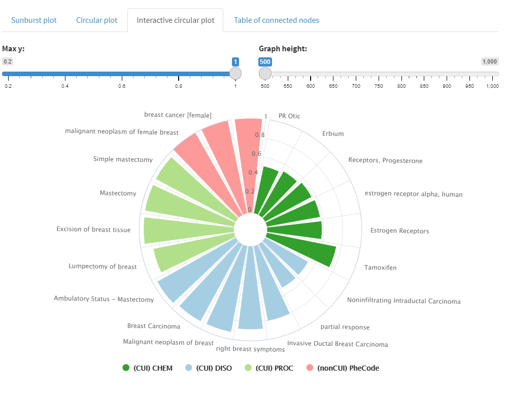
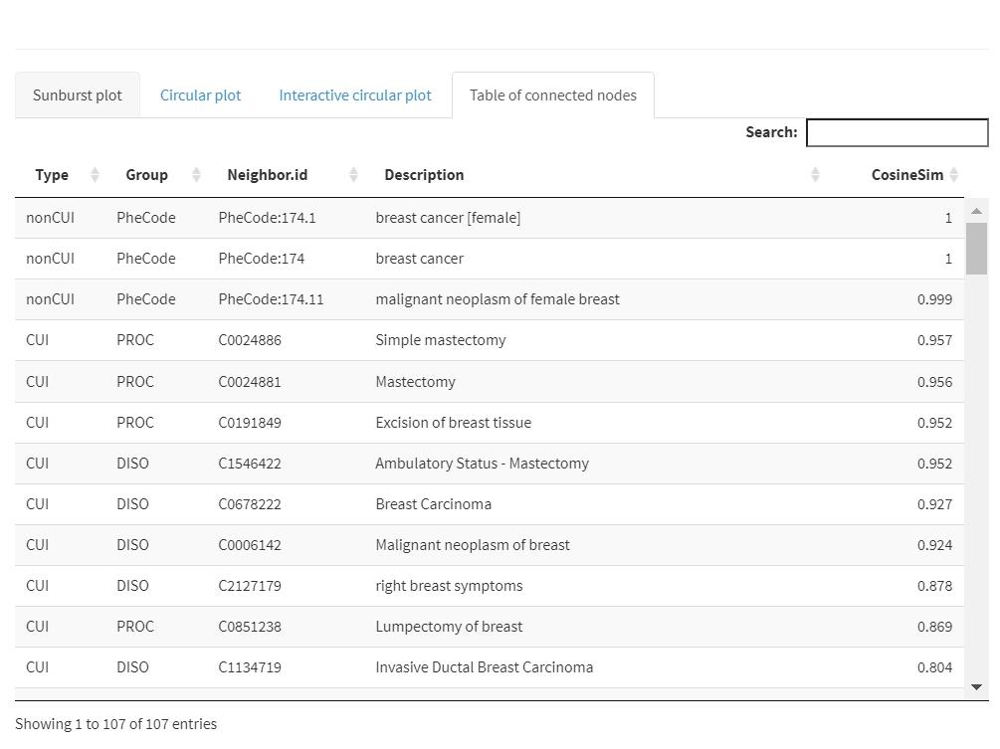
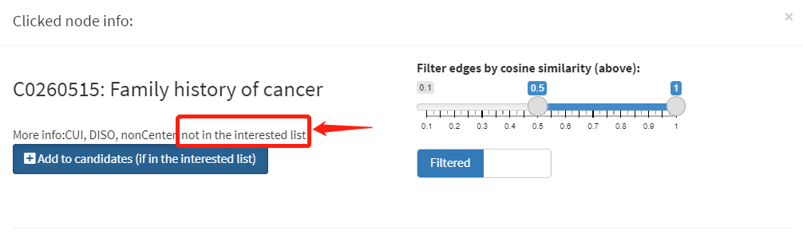

<!-- README.md is generated from README.Rmd. Please edit that file -->

# CUInetwork

<!-- badges: start -->

[](https://lifecycle.r-lib.org/articles/stages.html#experimental)
<!-- badges: end -->

The goal of CUInetwork is to generate an interactive shiny app that help
visualize the network of codified &/ NLP concepts.

## Installation

To install the latest development version from GitHub:

``` r
install.packages("remotes")
remotes::install_github("xinxiong0238/CUInetwork")
```

If errors like “Error: (converted from warning) package ‘shiny’ was
built under R version 4.0.5” occur, please set:

``` r
Sys.setenv("R_REMOTES_NO_ERRORS_FROM_WARNINGS" = "true")
```

You can refer to [this
website](https://github.com/r-lib/remotes/issues/403) to see more
discussion on that problem.

## Example

This is a basic example which shows you how to run the CUInetwork app.
Remember you need to get access to the data and save it to your local
computer. Remember in order to guarantee some dependencies are loaded,
you must use `library(CUInetwork)` beforehand, instead of directly
running CUInetwork::run\_app(data\_path)\!

``` r
library(CUInetwork)
data_path = "the path to the app data (RDS format)"
run_app(data_path)
```

## App instructions

To have a general understanding on how to get the CUInetwork app work,
we show some main steps here. If you want to know some detailed app
functionality, please refer to the ‘Get started’ tab.

### Step 1: choose your center node(s)

First of all, you need to specify your center node by clicking a row in
the `Possible inputs` table containing in the dropdown button. Multiple
inputs are acceptable. You can also use the search bar on the top or the
filtering bar for each column (`id`, `terms`, `group`) to spot on your
targets. A second round of searching will not mask the previous
selection, which will be kept unless you de-select the row or use the
“Unselect” button on the navigation bar. Once some rows are selected,
the app will automatically display them as selected CUIs or nonCUI codes
on the left.



### Step 2: show the connected network

When you select your interested center node(s), simply click the green
“Show” button to take a look at the connected network. Remember only
nodes directly linked to your center node(s) will be shown. For example
the following network only draws CUIs or codified concepts directly
connected to phecode 174.1 or phecode 174.2. In terms of nodes that have
indirect connection like A \<-\> intermediate node \<-\> center node,
they are not in the interests of this app.



### Step 3: explore network information

#### Main panel

In general, there are CUIs (or NLP nodes) and nonCUIs (codified
concepts) as two major classes of nodes, which we use circles and
triangles to represent. For CUIs, By hovering your mouse onto any node,
you will see the basic information including node ID and group name.



If hovering on an edge, a tooltip will show up with the connected node
information and the cosine similarity. However, this is not recommended
when the center node is surrounded by too many nodes, which easily leads
to mistouch.


You can use the nagivation buttons on the bottom to control the size of
the network and move the center of the graph. The same funcionality can
be achieved by scrolling up or down the mouse wheel or dragging any
blank area in the main panel. Clicking the download button on the top
right corner will start downloading a csv file including all edge
information on the graph (five columns: center node id/label, connected
node id/label and cosine similarity). The questionmark button opens an
instruction window.

  

#### Popup window

When the app generates the connected network for your center node(s),
you may want to dive into one specific node and take a further look.
This node can be one of the previous center nodes, or it can be a
non-center node but connected to a center. To achieve that, you just
need to click on any node on the canvas and a popup window will then
bring you more details (sunburst plot, static/interactive circular plot
and data table).










Remember, if you click on a non-center node, there is a chance that the
node is not in the interested list of the current app. If so, the popup
window is not able to provide much more information. The “Possible
inputs” table shows all nodes in the interested list.


